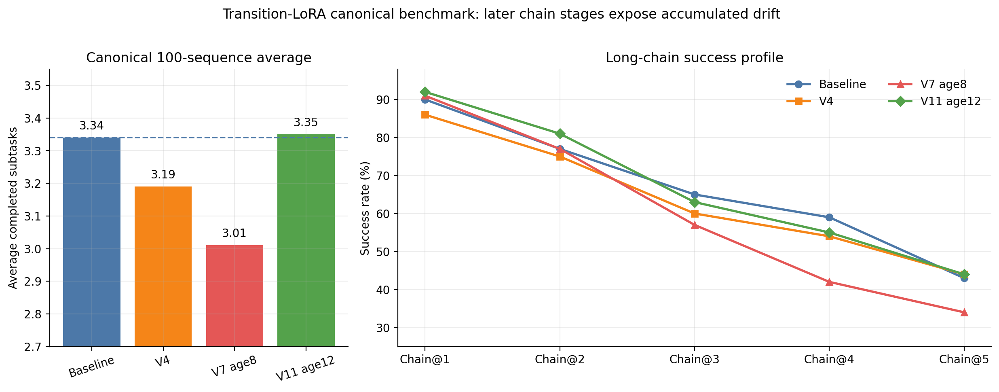
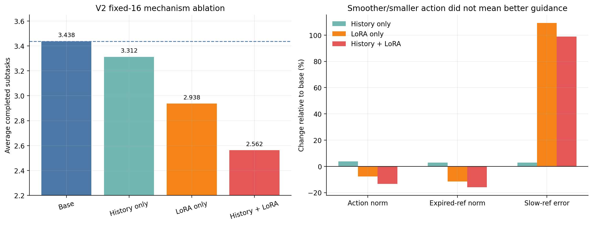
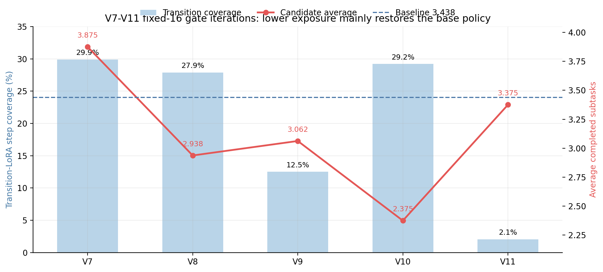
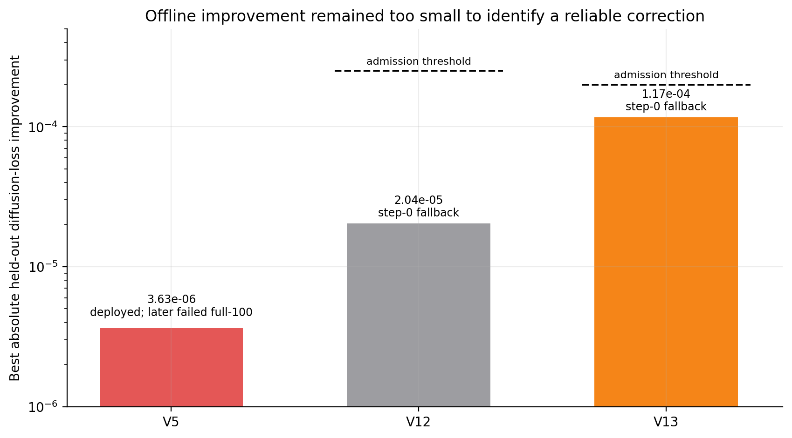
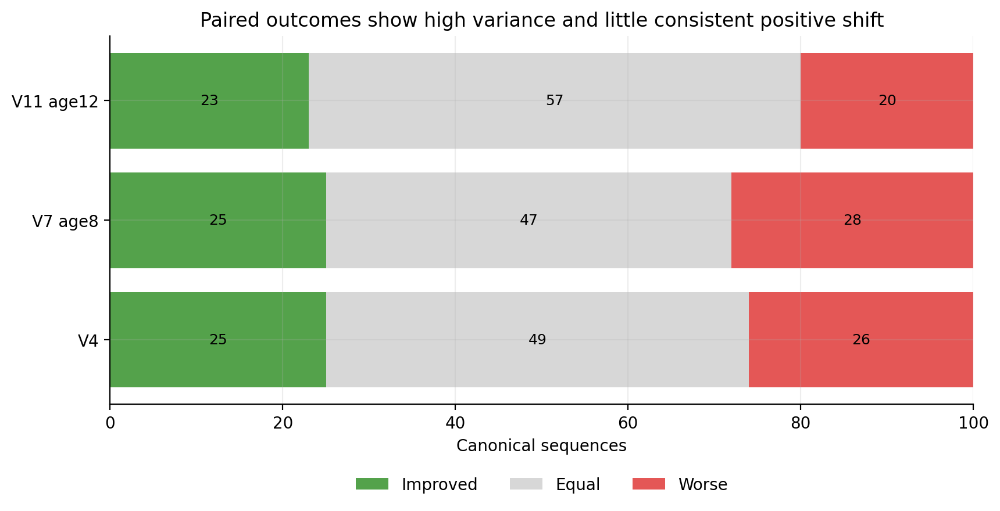

# 组会报告：Transition-LoRA 负结果复盘与 failure-recovery 路线


## 1. 本次汇报结论

过去两周通过 13 次有递进关系的尝试，基本排除了“继续调 LoRA rank、插层、checkpoint 或 age gate 就能稳定提升长链成功率”的解释。

当前最可信的判断是：

> 现有 LoRA 用 baseline 成功 rollout 中的 baseline action 重新监督 baseline specialist。这样的 self-imitation 数据没有告诉模型，在 baseline 将要失败的状态上应该如何做得更好。因此 LoRA 的最优解接近复现 base；任何可见的非零 correction 都可能成为长链中的累积策略偏移。

完整 100-sequence 结果支持这一点：

| 策略 | 平均链长 | Chain@1 | Chain@2 | Chain@3 | Chain@4 | Chain@5 |
|---|---:|---:|---:|---:|---:|---:|
| task-age baseline | 3.34 | 90% | 77% | 65% | 59% | 43% |
| V4 narrow preserved LoRA | 3.19 | 86% | 75% | 60% | 54% | 44% |
| V7，V5 权重、age 8 gate | 3.01 | 91% | 77% | 57% | 42% | 34% |
| V11，同一 V5 权重、age 12 gate | 3.35 | 92% | 81% | 63% | 55% | 44% |



V7 在 Chain@1 上没有明显问题，退化集中在 Chain@3–5。这正是“小策略偏移经过闭环和长链逐步放大”的形态。V11 看似恢复到 3.35，但它只在约 2.64% 的短测 step 上启用 LoRA，更合理的解释是减少了 LoRA 的影响范围，而不是 correction 质量变好了。

下一阶段建议把问题从“如何用 LoRA 模仿成功 trajectory”改写为：

> 如何在 baseline 自己访问到的失败边界上，获得成功 recovery branch，并训练一个只有在预测 advantage 为正时才启用的 residual correction？

LoRA 仍然可以保留，但它只是 correction 的参数化方式，不再是研究问题本身。

---

## 2. 问题如何演化到当前形式

### 2.1 原始问题：slow guidance 刷新造成 handover 突变

最初的 Legato-like 设想是：

```text
fast specialist 已执行一段旧轨迹
→ 新 slow hidden / ref action 到达
→ specialist 接受新指导，同时保持 committed trajectory continuation
```

这个问题强调 refresh 时刻的新旧 condition 接入和动作连续性。

### 2.2 当前代码实际解决的是 stale-reference correction

V7–V13 的实际部署逻辑已经变成：

```text
slow_age_after >= gate_start_age
AND reference action 已耗尽
→ 将指定 specialist 权重从 base 切换为 transition-LoRA 权重
```

也就是说，当前 LoRA 不是在新 slow guidance 到达时生效，而是在 slow condition 已经 stale、ref action 已为空时生效。实际问题应重新框定为：

设 frozen specialist 为

\[
\pi_0(A_t\mid o_t,c_{t-a},r_{t-a}),
\]

其中 `a` 是 slow age，`r` 在 `a>=8` 后已经耗尽。需要学习 correction `δ` 和 gate `g`：

\[
\pi(A_t)=\pi_0(A_t)+g(s_t)\,\delta(A_t\mid s_t),
\]

使得：

1. 在真实风险状态上提高当前 subtask completion probability；
2. 在 normal / 非触发状态上严格接近 `π0`；
3. correction 不因长链累积而破坏后续任务；
4. gate 判断的是 correction advantage，而不是仅判断 slow age。

当前实现中的 `g(s_t)` 实际只有 `slow_age_after >= threshold`。它能限制 LoRA 影响范围，但不能判断 LoRA action 是否比 base action 更好。

### 2.3 为什么“更平滑”不等于“更成功”

V2 的固定 16 条消融已经给出非常明确的反例：

- `LoRA only` 的 action norm 下降 7.7%，expired-ref norm 下降 11.5%；
- `History + LoRA` 的 action norm 下降 13.4%；
- 但两者平均链长分别从 3.438 降到 2.938 和 2.562；
- slow-reference error 反而接近翻倍。



因此平滑度、jerk、动作幅度只能作为安全诊断，不能作为长链成功率的代理目标。任务可能本来就需要快速反向、重新抓取或较大幅度纠偏。

---


## 4. 13 次尝试的纵向复盘

需要注意：V1–V13 是实验迭代编号，不等于 13 个完全独立训练的 checkpoint。V7–V11 中大部分实验复用了 V5 权重，主要改变部署缩放、checkpoint 或 gate。

| 版本 | 核心改动 | 结果 | 排除或支持的解释 |
|---|---|---|---|
| V1 | history adapter + 宽 LoRA；使用污染 action target | 在线平均链长约 1.87 | 首先暴露 target action scale 污染，不能据此评价方法 |
| V2 | 修复 committed action；14 个 LoRA target + history | 离线 loss 大幅改善；固定 16 条 `full=2.5625`，base `3.4375` | 数据修复后仍退化；宽 LoRA 和 history 组合产生欠执行及负交互 |
| V3 | 只保留最后两层 temporal projection；加入 base preservation | 100 条记录约 2.77 平均链长 | 缩窄插层缓解但未恢复 base；标签 MSE 仍不能预测闭环 |
| V4 | 更完整的 preservation/checkpoint 选择 | canonical 3.19，base 3.34 | 窄 LoRA 避免灾难性退化，但没有正收益 |
| V5 | matched-noise teacher drift；按离线 gain/drift 选 checkpoint | gain 仅 `3.63e-6`；固定 16 条约 3.3125 | 极小离线 gain 可以对应显著闭环变化；selector 辨识力不足 |
| V6 | 对 V5 delta 做 0.5 缩放 | 固定测试约 2.94 | 权重线性缩放不产生可预测的闭环行为缩放 |
| V7 | V5 full delta，只在 age>=8 且 ref expired 时 gate | 固定 16 条 3.875；完整 100 条 3.01 | 固定小集合结论反转；短测被重复调参污染，长链明显退化 |
| V8 | V6 half delta + age 8 gate | 固定 16 条 2.9375 | half delta 既未保留 V7 短测收益，也未控制动作漂移 |
| V9 | 恢复 full delta，将 gate 推迟到 age 10 | 固定 16 条 3.0625 | 动作统计接近 base，但成功率仍未恢复 |
| V10 | 使用训练真实 step-500 checkpoint，age 8 gate | 固定 16 条 2.375 | 更早、更小 drift 的优化点反而最差，进一步否定离线 drift selector |
| V11 | 恢复 V5 full delta，gate 推迟到 age 12 | 固定 16 条 3.375；完整 100 条 3.35 | 主要通过将 LoRA 覆盖压到极低水平恢复 base，不是 correction 变好 |
| V12 | 只训练 normal/stale；轨迹平衡；rank-2 condition path | 最佳 gain `2.04e-5 < 2.5e-4`，回退 step 0 | 训练/部署对齐仍不足，问题不只是 category mismatch |
| V13 | 加 x-embedding；rank 4；前两 token 2×；更弱 stale preservation | 最佳 gain `1.169e-4 < 2e-4`，回退 step 0 | 容量和首步权重提高可学习性，但仍缺乏可辨认的新监督信息 |

### 4.1 V7–V11：gate 只能减少 blast radius



这组结果没有形成任何稳定的单调规律：

- V8 将权重减半，没有获得“行为偏移减半”；
- V10 使用更早、离线 drift 更小的 checkpoint，闭环反而最差；
- V9 推迟 gate 后动作分布接近 base，但成功率仍未恢复；
- V11 的恢复与 LoRA 覆盖率下降到约 2.64% 同时发生。

所以 age gate 的合理职责是：

```text
限制一个已经验证有效的 correction 在哪些状态生效
```

而不是：

```text
通过减少一个不确定 correction 的作用次数，让总体结果看起来接近 base
```

### 4.2 V12/V13：停止规则是有效实验结果



V12/V13 没有为了“多跑一次在线评测”而事后降低阈值，这是正确的停止决定：

- V12 最佳 improvement 仅达到阈值约 8.2%；
- V13 提升到阈值的 58.5%，说明 action-condition path 和 front weighting 确实增加了可学习性；
- 但 gain 仍太小，不能证明它超过 validation 噪声和 checkpoint selection 偏差；
- 两者 merged checkpoint 都明确来自 step 0 base fallback，因此不能将其记为在线候选失败。

### 4.3 paired 结果说明缺少一致正向迁移



V4、V7、V11 都同时存在不少 improved 和 worse sequence。V11 的净结果只有 `+1` 个完成 subtask，bootstrap 95% CI 为 `[-0.35,+0.38]`。这不是稳定正收益，而是高方差下基本回到 baseline。

---

## 5. 原因判断

### 5.1 最强原因：target 不包含超过 baseline 的信息

现有 repaired target 是 baseline 在成功 rollout 中实际 committed 的 action：

```text
baseline 成功状态
+ baseline slow condition
→ baseline 自己执行过的 action
```

训练能够提高这些动作在成功状态分布上的似然，但不能回答：

```text
baseline 已偏离或即将失败时
→ 哪个 action 能回到成功轨迹？
```

失败 trajectory 不进入监督数据，模型也看不到 rejected action。因此，从信息角度看，当前数据没有定义 `δ` 应朝什么方向改变。

### 5.2 5600 个窗口不等于 5600 个独立纠错状态

现有 train split 有 5600 个窗口，但只来自约 347 条 trajectory，并且大量窗口相邻重叠。D 组只有 3 条成功 trajectory。有效覆盖的是少量成功模式，而不是多样化失败边界。

后续数据规模应按以下单位报告：

- 独立 failure episode 数；
- 独立 restored state 数；
- 每个 state 的成功/失败 branch 数；
- 每个任务组的 failure-state quota；
- held-out failure state 数。

不再以重叠 window 总数作为主要数据规模。

### 5.3 diffusion validation loss 不是闭环 selector

固定 noise/timestep 的 held-out diffusion loss 适合检查训练是否稳定，但没有包含：

- 多步 denoising 后 action chunk 的实际分布；
- temporal aggregation；
- 环境接触动力学；
- 下一 observation 的改变；
- 长链前序失败导致的截断。

因此 selector 至少需要加入同状态 branch replay success，最终仍要由独立闭环评测决定。

### 5.4 当前 history adapter 表达不匹配 continuation

现有 history adapter 将 `[B,4,7]` flatten 成单一 hidden vector，并广播到所有 condition token。这样会丢失：

- 四个历史动作的时间位置；
- 已 committed prefix 与可修改 suffix 的对应关系；
- slow delay/age；
- old/new chunk 的 overlap mask；
- 不同 future action token 应受历史约束的不同强度。

所以 V2 的 `history_only` 负结果不能证明 action history 无用，只能证明当前“flatten + global broadcast”不是理想的 continuation 表达。

---

## 6. 网络检索结果：可借鉴方案

### 6.1 Failure-recovery DAgger / human intervention

DAgger 的基本思想是在 learner 自己诱导的状态分布上取得 expert label，从而处理行为克隆的闭环分布偏移。原始论文指出 sequential prediction 不满足普通 i.i.d. 假设，并提出在 learner 访问状态上迭代聚合数据：[DAgger, AISTATS 2011](https://proceedings.mlr.press/v15/ross11a.html)。

更接近当前长链任务的是：

- [HG-DAgger](https://arxiv.org/abs/1810.02890)：由人决定何时接管，并学习风险阈值；
- [ThriftyDAgger](https://proceedings.mlr.press/v164/hoque22a.html)：根据 novelty 和 predicted risk 控制 intervention 预算；
- [Sirius 官方 GitHub](https://github.com/UT-Austin-RPL/sirius)：部署过程中采集 intervention，并持续改进 manipulation policy；
- [IntervenGen](https://arxiv.org/abs/2405.01472)：利用少量人工 intervention 自动扩展出更丰富的 corrective data；
- [RaC](https://rac-scaling-robot.github.io/)：专门面向长链任务，将 intervention 分为 recovery back to in-distribution state 和 correction to finish subtask；
- [LeRobot HIL 数据采集文档](https://github.com/huggingface/lerobot/blob/main/docs/source/hil_data_collection.mdx)：可参考 autonomous/recovery/correction 段的工程记录方式。

与现有方案的区别：

| 当前 self-imitation | Failure-recovery 数据 |
|---|---|
| 只看成功状态 | 专门看 learner 自己的失败边界 |
| 标签来自 baseline 自己 | 标签来自 expert 或成功 recovery branch |
| 只有正 action | 同状态下存在成功和失败候选 |
| 优化动作似然 | 可以优化 recovery probability / preference |
| 无法训练 advantage gate | 可以直接给 gate 提供 correction 是否优于 base 的标签 |

可直接借鉴的点：

1. intervention 单元围绕“即将失败的当前 subtask”，不重新采一整条长链；
2. recovery 和 correction 分段保存；
3. split 按原始 failure state，而不是按窗口；
4. gate 由 risk/advantage 学习，但必须有人工或环境成功标签校准；
5. 长链能力来自学会 retry/recovery，而不是仅减少 nominal trajectory 的 jerk。

### 6.2 Diffusion preference optimization

[Forward-KL Regularized Preference Optimization](https://ojs.aaai.org/index.php/AAAI/article/view/33576)直接用 preferred/rejected pair 对齐 diffusion policy，并使用 forward KL 约束 policy 不要偏离原始分布。

[FDPP](https://arxiv.org/abs/2501.08259)先从 preference 学 reward，再通过 RL 微调 diffusion policy，同时用 KL 保持原始任务能力。

这类方法非常适合同一 restored state 上的 branch 数据：

```text
(state, successful action branch, failed action branch)
```

它与当前 MSE 的关键区别是：不要求成功 action 是唯一正确模式，只要求成功 branch 的 score/likelihood 高于失败 branch。对于具有多模态解法的 manipulation，这比把一个 action chunk 当唯一回归目标更自然。

可借鉴目标：

\[
L = L_{\text{positive diffusion}}
+\lambda L_{\text{preference}}(A^+,A^-)
+\beta D(\pi_{\text{adapter}},\pi_0)
+\gamma L_{\text{normal zero residual}}.
\]

### 6.3 Diffusion Policy Policy Optimization

[DPPO 论文](https://openreview.net/forum?id=mEpqHvbD2h)和[官方 GitHub](https://github.com/irom-princeton/dppo)将 diffusion denoising 过程视作可进行 policy-gradient 微调的策略，并给出了只微调部分 denoising steps 等实践。

DPPO 的优势是直接优化环境 return，而不是使用 diffusion MSE 代理。但直接在 CALVIN 五任务长链上做 PPO 会遇到稀疏奖励和高方差。更适合当前项目的方式是：

```text
restore failure state
→ rollout 当前 subtask 30–80 steps
→ 得到 success/failure reward
→ adapter-only DPPO + base KL
```

因此 DPPO 更适合作为 recovery BC/preference learning 后的第二阶段，而不是第一步。

### 6.4 显式 delay/history conditioning

几个近期工作与 RoboDual 的异步 fast/slow 结构高度相关：

- [Acting While Understanding](https://arxiv.org/abs/2606.15285)：异步复用低频 semantic condition，高频 action module 加入 historical-action conditioning 和 time-misalignment training；
- [Action ControlNet](https://arxiv.org/abs/2606.25985)：冻结 backbone，使用 executed motion suffix 和 delay-aware residual adapter 修正异步 chunk；
- [Legato](https://arxiv.org/abs/2602.12978)：把 continuation 直接训练进 flow policy 的 denoising dynamics；
- [Soft RTC](https://arxiv.org/abs/2605.25537)：不将 overlap token 简单视为固定/自由二值状态，而是将旧 action chunk 作为逐 token prior。

与当前 history adapter 的区别：

| 当前 history adapter | 可借鉴的异步 continuation 设计 |
|---|---|
| 4×7 action flatten 为一个向量 | 保留 action token 的时间结构 |
| 对所有 condition token 同样广播 | 按未来 token/overlap 位置施加不同先验 |
| 不显式输入 delay | randomized delay / age embedding |
| 不区分 committed 和 editable | prefix/overlap mask |
| 通过整组权重硬切换 | residual adapter 或 denoising prior |

这条路线能够改善 continuation 和 stale-condition robustness，但不能单独产生“失败时应该怎样恢复”的新知识。因此它应和 recovery data 结合，而不是继续单独使用成功轨迹验证。

### 6.5 LoRA/VLA 文献对当前结果的正确解释

[OpenVLA 官方 GitHub](https://github.com/openvla/openvla)提供 LoRA fine-tuning，并在 LIBERO 上使用 rank-32 LoRA。近期针对工业 manipulation 的研究也报告部分 LoRA 配置可以接近 full fine-tuning：[On the Efficiency of LoRA Fine-Tuning for VLA Models](https://arxiv.org/abs/2607.10172)。

这些结果说明：

```text
当新数据包含新任务、专家 action 或 embodiment information 时，LoRA 有足够能力吸收它。
```

它们不能说明：

```text
在没有新纠错信息时，提高 rank 会自动提高原任务成功率。
```

所以当前 LoRA 负结果不是“LoRA 不适合机器人”，而是“成功轨迹 self-imitation 不足以产生正 correction”。

---

## 7. 方案比较与优先级

| 方向 | 提供的新信息 | 能否直接解决当前根因 | 工程成本 | 建议优先级 |
|---|---|---:|---:|---:|
| Failure-state recovery branch | 同状态成功/失败结果 | 是 | 中 | 1 |
| Recovery preference/ranking LoRA | 成功 branch 优于失败 branch | 是 | 中 | 2 |
| Advantage/risk gate | correction 相对 base 的收益 | 是，但依赖 branch label | 中 | 3 |
| Token-wise history/delay adapter | committed suffix 和 delay 结构 | 解决 continuation，不直接提供 recovery | 中 | 4 |
| Adapter-only DPPO | 环境 success return | 是 | 高 | 5 |
| CALVIN expert stale re-label | 专家 action | 部分，存在 online failure state 分布差异 | 高 | 6 |
| 增大 rank/层数 | 只增加容量 | 否 | 低 | 不继续 |
| 搜更多 age threshold | 只改变 exposure | 否 | 中 | 不继续 |
| Post-hoc delta scaling | 只改变权重幅度 | 否且无单调性 | 低 | 不继续 |
| Mixture-of-LoRA routing | 增加路由复杂度 | 没有标签时不能创造 correction | 高 | 暂不做 |

---

## 8. 推荐方案：Failure-state Branch Preference LoRA

### 8.1 阶段 0：先验证环境 state restore

现有 collector 已保存 `robot_obs` 和 `scene_obs`，CALVIN wrapper 支持通过二者 reset。但接触、抓取和内部物理状态能否完全复现，需要先实验确认。

选择约 20 个稳定复现的 baseline failure states：

1. 保存 observation、`robot_obs`、`scene_obs`、instruction、task group；
2. 保存 slow hidden/action、slow age、ref-valid count；
3. 保存最近四步 committed actions、aggregation buffer；
4. 用同 seed restore 5 次；
5. 比较 reset 后图像、robot state、任务状态和后续结果；
6. 不能稳定 restore 的 state 不进入训练集。

成功标准不是像素完全相同，而是任务物理状态和给定 action branch 的 outcome 足够稳定。

### 8.2 阶段 1：生成同状态 recovery branches

每个 failure state 尝试 8–16 个 branch：

- base specialist，不同 diffusion seed；
- 强制当前 observation 重新调用 slow generalist；
- base + action-history prior；
- 必要时 CALVIN expert/demo continuation；
- 后续可加入当前 residual candidate。

每个 branch 保存：

```text
failure_state_id
observation / environment state
instruction / subtask
old and refreshed slow condition
slow age / ref validity
last committed action suffix
candidate action chunk
diffusion seed and denoising metadata
within-horizon subtask success
time-to-success / terminal failure reason
```

只在同一 state 至少存在一个 success 和一个 failure branch 时形成 preference pair。

最小可行数据目标：

```text
20 independent failure states
× 8–16 candidate branches
→ 160–320 branch rollouts
→ 100–200 successful/failed pairs
```

如果大部分 failure state 在 16 个 seed 和强制 refresh 下都没有成功 branch，说明需要 expert intervention，而不是继续依靠 stochastic search。

### 8.3 阶段 2：训练受保护的 residual LoRA

建议保留 V13 已验证的六个 action-condition target：

```text
model.x_embedder
model.context_adapter
blocks 4/5 cross-attention l/value projections
```

但部署时不要再通过复制整组 merged weight 硬切换，而是保留显式 residual scale：

\[
h'=Wh+g(s)\alpha BA h.
\]

初始建议：

- rank 2，alpha 2；
- base 永久冻结；
- normal 状态 residual target 为零；
- positive recovery 做 diffusion/action supervision；
- paired branch 做 preference/ranking；
- gripper sign 单独保护；
- repaired successful data 仅用于 normal replay 和 base preservation。

训练 loss：

```text
positive recovery diffusion loss
+ first-two-action weighted loss
+ successful > failed branch preference loss
+ normal matched-noise base preservation
+ gripper sign preservation
+ residual norm penalty
```

### 8.4 阶段 3：训练 advantage gate

gate 输入建议从小而可解释的特征开始：

```text
normalized slow age
ref_valid_count
base/ref action disagreement
K-seed diffusion variance
base action norm and gripper state
recovery critic Q(candidate)-Q(base)
```

gate 标签来自同状态 branch outcome：

```text
1: candidate recovery 显著优于 base
0: candidate 不优于 base，或两者都失败
```

部署条件：

```text
reference exhausted
AND predicted advantage > margin
AND gate confidence calibrated
```

加入 hysteresis 或 minimum-on-duration，避免逐 step 在 base/LoRA 间反复切换。

这里需要强调：gate 不能先于 correction 被验证。正确顺序是先证明 residual 在 held-out failure states 有正 advantage，再训练 gate 选择它何时生效。

### 8.5 阶段 4：可选 DPPO 微调

如果 recovery preference LoRA 已经在 held-out branch replay 上超过 base，可以在 restored failure state 上做短 horizon DPPO：

```text
reward = current-subtask success
       - action/residual penalty
       - unsafe gripper/constraint penalty
```

只更新 LoRA/residual 和最后少量 denoising steps，并使用 base KL。不要直接从五任务 sparse long-chain reward 开始。

---

## 9. 评测设计

### 9.1 数据划分

按 `failure_state_id` 分组：

```text
train / validation / test = 70% / 15% / 15%
```

同一个 state 的不同 seed、positive/negative branch 必须处于同一 split。D 组和 V7/V11 共同退化的长链任务设置最低 state quota。

### 9.2 四级准入

1. **离线 preference**
   - held-out pair ranking accuracy；
   - successful branch likelihood 相对 failed branch 的 margin；
   - first-action error、action norm、gripper sign；
   - normal prediction drift。

2. **同状态 branch replay**
   - held-out failure states 上的 paired recovery SR；
   - base/candidate 使用相同 state 和 seed；
   - 报告每个任务组的结果。

3. **新 short-sequence holdout**
   - 不使用已经反复调参的固定 16 条选 checkpoint；
   - 每个 sequence 至少 3 个 diffusion seed；
   - 同时报 success、action statistics 和 gate coverage。

4. **Canonical 100 条**
   - candidate 通过前三级后才启动；
   - 最好 baseline/candidate 都运行 3 seeds；
   - 报 paired mean、bootstrap CI、Chain@1–5；
   - 主指标为平均完成 subtask 和 Chain@3–5。

### 9.3 不再使用的评测习惯

- 不在固定 16 条上反复选 checkpoint/gate 后仍将其称为 validation；
- 不凭单个 seed 的最大值选模型；
- 不用 diffusion loss 或 parameter drift 单独宣称闭环改善；
- 不把 jerk 降低解释成任务能力提高；
- 不把 step-0 fallback 当成有效 LoRA candidate。

---

## 10. 预期风险与停止条件

### 风险 1：CALVIN state restore 不完整

如果 `robot_obs/scene_obs` 不能恢复抓取约束或接触状态，需要保存/恢复更底层 simulator state，或只选择可稳定 reset 的非接触边界。

### 风险 2：随机 seed 找不到成功 recovery

这说明 failure state 已经超出 base policy support。停止扩大 seed 数，转向 expert intervention 或 CALVIN demonstration re-label。

### 风险 3：preference accuracy 提升但闭环不提升

说明 branch scorer 或 likelihood objective仍与环境 outcome 错位。此时优先使用 branch-level critic/DPPO，不继续增加 LoRA 容量。

### 风险 4：learned gate 只学会关闭 correction

如果最优 gate 长期覆盖接近零，说明 residual 没有稳定正 advantage。应回到数据/label，而不是继续调 gate threshold。

### 本路线停止条件

满足任一条件则暂停 LoRA recovery 路线：

1. 20 个 failure states 中不足 5 个能产生成功 branch；
2. held-out branch recovery SR 不高于 base；
3. advantage gate 的正样本极少或校准失败；
4. 新 short holdout 三 seed 的 paired mean 不为正；
5. 正收益只能通过极低覆盖率恢复 base。

---

## 11. 下一步执行顺序

### 第一周

1. 实现 failure snapshot 和 deterministic restore audit；
2. 选 20 个已知失败状态；
3. 每个状态运行 8 个 seed + forced refresh；
4. 统计 branchability 和 success/failure pair 数量。

### 第二周

1. 如果 recovery pair 足够，建立按 failure state 划分的数据格式；
2. 训练 base-frozen rank-2 residual LoRA；
3. 先做 positive BC + normal preservation；
4. 再加入 pairwise preference，比较其增量。

### 第三周

1. 训练/校准 advantage gate；
2. held-out branch replay；
3. 新 short holdout × 3 seeds；
4. 只有全部通过才进入 canonical 100。

---

## 12. 本次组会希望确认的问题

1. 是否同意停止在现有成功 rollout 上继续增加 rank、层数或训练步数？
2. 是否将下一阶段主线明确改为 failure-state recovery branch，而不是继续做 gate sweep？
3. 第一批 recovery branch 是否先完全使用 CALVIN simulator search/forced refresh，之后再决定是否引入人工 expert？
4. residual 第一版是否复用 V13 六个 action-condition LoRA target，rank 从 2 开始？
5. continuation adapter 是否作为 recovery LoRA 的后续增量，而不是单独作为成功率主线？
6. canonical 100 是否要求至少通过 held-out branch replay 和三 seed short holdout 后才运行？

---

## 13. 汇报时的简短结论

过去 13 次 Transition-LoRA 实验已经把问题从“LoRA 怎么调”推进到了“监督信息缺什么”。数据修复、窄插层、base preservation、checkpoint selection、权重缩放、早停、age gate、stale-only condition path 和首步加权都没有产生稳定正收益。唯一稳定现象是 LoRA 作用越少，系统越接近 baseline。

下一步不应放弃 LoRA，而应改变 LoRA 学习的内容：

> 从“模仿 baseline 成功时的自己”，转为“在 baseline 会失败的同一状态上，学习哪个小 correction 真正能够 recovery”，并让 gate 基于 correction advantage 而不是 slow age 决定是否启用。

这条路线同时对应 DAgger/RaC 的 on-policy corrective data、diffusion preference learning 的成功/失败配对，以及 ACNet/Legato 类工作的显式 history/delay conditioning，是目前最有可能解决长链累积失败、同时保留原 specialist 能力的方案。

---

## 附录：文件与复现

报告目录：

```text
personal_log/meeting_log/meeting0717/
```

图表生成：

```bash
MPLCONFIGDIR=/tmp/robodual-matplotlib \
python personal_log/meeting_log/meeting0717/make_meeting0717_assets.py
```

产物：

```text
01_canonical_100seq_comparison.png
02_v2_ablation_and_action_drift.png
03_gate_iteration_coverage.png
04_offline_gain_and_admission.png
05_paired_sequence_outcomes.png
experiment_summary.csv
experiment_summary.json
```

图表数据源：

```text
evaluation_results/exp0713_LoRA_v_check/ablation_summary.json
evaluation_results/exp0713_LoRA_v4_100seq/benchmark_summary.json
evaluation_results/exp0714_LoRA_v7_gated_check/gate_summary.json
evaluation_results/exp0714_LoRA_v8_gated_half_check_retry1/gate_summary.json
evaluation_results/exp0715_LoRA_v9_gated_age10_check/gate_summary.json
evaluation_results/exp0715_LoRA_v10_step500_gated_check/gate_summary.json
evaluation_results/exp0715_LoRA_v11_gated_age12_check/gate_summary.json
evaluation_results/exp0715_LoRA_v11_gated_100seq/benchmark_summary.json
evaluation_results/exp0716_LoRA_v7_gated_100seq/benchmark_summary.json
```
